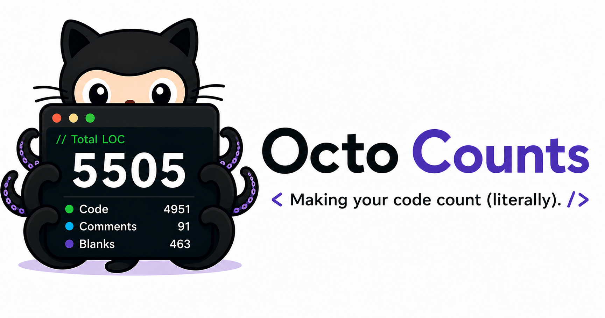
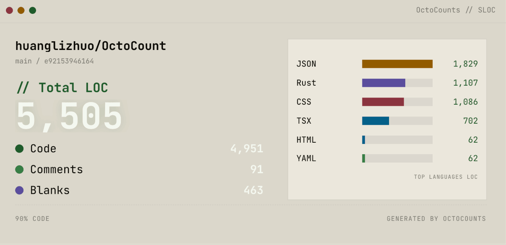

<p align="center">
  
</p>

# OctoCounts – fast SLOC reports for public GitHub repos

> Paste a GitHub URL. Get a line count. Feel productive.

OctoCounts counts source lines of code in public GitHub repositories — without cloning anything to your laptop. It downloads the archive, runs [tokei](https://github.com/XAMPPRocky/tokei), caches the result by commit SHA, and hands you a sortable report before you can finish typing the URL.

Built for developers who want quick SLOC visibility and refuse to wait for `git clone` to finish just to run `tokei` on someone else's repo.

### export with preview image

<p align="center">
  
</p>

## What it does

- Resolves any branch, tag, or commit SHA — pins results to an exact commit so the cache is actually meaningful
- Downloads the GitHub archive tarball instead of cloning (much faster, no git history overhead)
- Counts files, lines, code, comments, and blanks per language via tokei
- Caches reports by `owner + repo + commit + tokei version` — repeat runs are instant
- Queues analysis jobs so concurrent requests don't bring the server to its knees
- Exports reports as plain text, JSON, or a shareable PNG card

## Stack

| Layer | Tech |
|---|---|
| Backend | Rust · Axum · Tokio · SQLx · SQLite · tokei |
| Frontend | React · TypeScript · Vite · TanStack Query |
| Infra | Docker Compose (dev + prod configs) |

## API

Three endpoints, that's it:

```
POST /api/analyze    { "repoUrl": "...", "refName": "main" }
GET  /api/jobs/:id
GET  /api/reports/:id
```

## Running it

See **[how-to-run-and-deploy.md](how-to-run-and-deploy.md)** for local development setup, host-native instructions, GitHub token configuration, and production deployment.

## License

MIT
