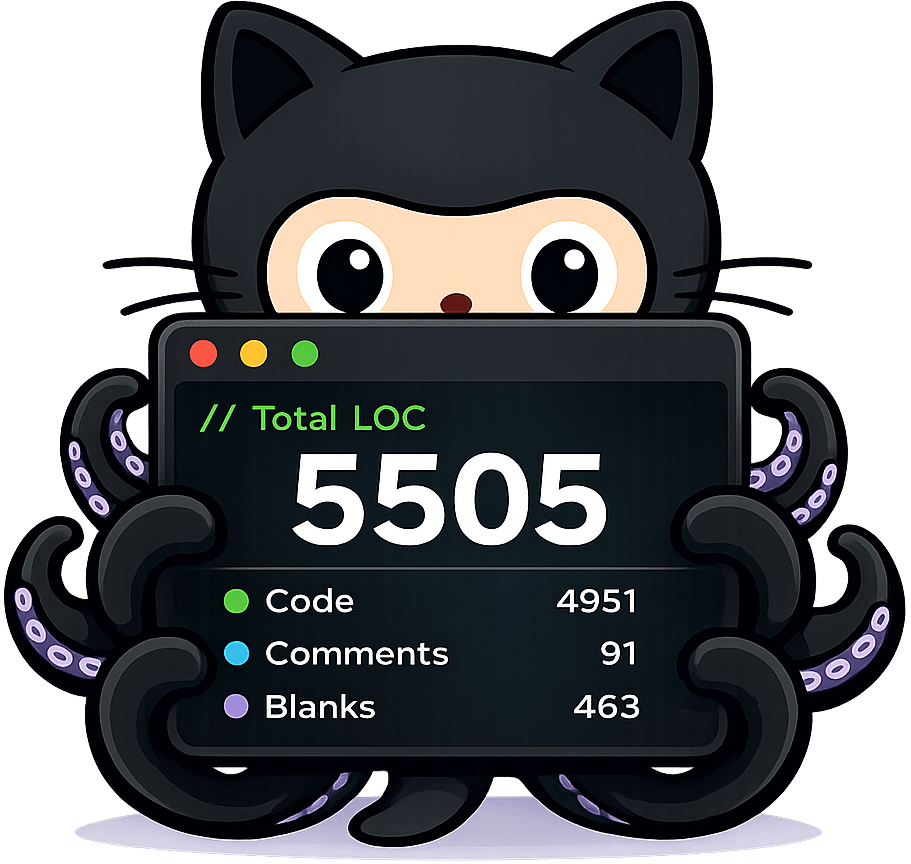
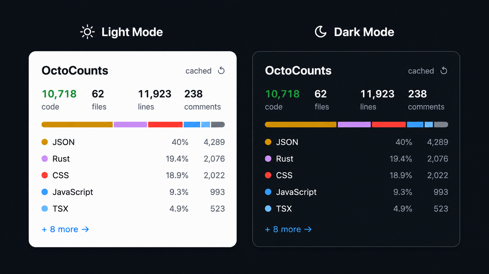

<p align="center">
  
</p>

# OctoCounts – the SLOC panel GitHub forgot

> GitHub shows language bars. OctoCounts shows the actual line counts.

[](https://chromewebstore.google.com/detail/octocounts-%E2%80%94-github-sloc/gkgjpjdnaklagijmekoolhcpebmoldbj)
[](https://addons.mozilla.org/en-US/firefox/addon/octocounts-github-sloc/)
[](https://octocounts.com/?q=https://github.com/huanglizhuo/OctoCount)

GitHub's sidebar shows language percentages, but misses actual file and line counts. OctoCounts adds this missing SLOC (Source Lines of Code) view to public repos without cloning.

Install the extension for instant stats directly on GitHub, or use the web app. It downloads the repo archive, runs [tokei](https://github.com/XAMPPRocky/tokei), and caches the results—delivering a breakdown faster than `git clone`.

## Preview

<p align="center">
  
</p>

## Why?

Sometimes you just want to know whether a repo is 2k lines, 200k lines, or a weekend-devouring monolith. GitHub already has the repo, the language stats, and the sidebar. OctoCounts fills in the missing numbers.

## What it does

- Adds a browser extension card to GitHub repo pages with files, total lines, code, comments, blanks, and language count
- Provides a web app where you can paste any public GitHub repo URL
- Resolves any branch, tag, or commit SHA — pins results to an exact commit so the cache is actually meaningful
- Downloads the GitHub archive tarball instead of cloning (much faster, no git history overhead)
- Counts files, lines, code, comments, and blanks per language via tokei
- Caches reports by `owner + repo + commit + tokei version` — repeat runs are instant
- Queues analysis jobs so concurrent requests don't bring the server to its knees
- Exports reports as plain text, JSON, or a shareable PNG card

## Stack

| Layer | Tech |
|---|---|
| Backend | Rust · Axum · Tokio · SQLx · Postgres · tokei |
| Frontend | React · TypeScript · Vite · TanStack Query |
| Infra | Docker Compose (dev + prod configs) |

## API

Three endpoints, that's it:

```
POST /api/analyze    { "repoUrl": "...", "refName": "main" }
GET  /api/jobs/:id
GET  /api/reports/:id
```

## Running it

See **[how-to-run-and-deploy.md](how-to-run-and-deploy.md)** for local development setup, host-native instructions, GitHub token configuration, and production deployment.

## License

[MIT](LICENSE)
